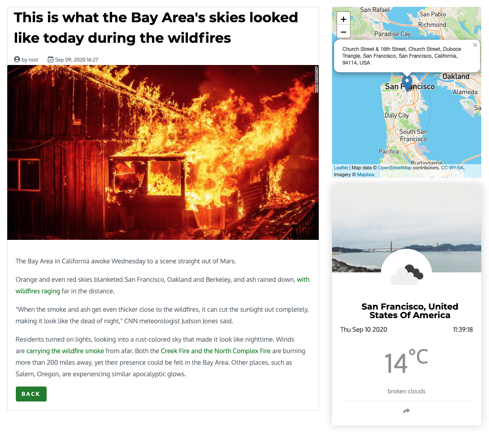

Location module
======================
The Location module extend any editorial content with additional properties (mixin) such as address (street, zip code, city and country) and latitude, longitude coordinates.
Latitude and longitude can be calculated automatically using the locationIQ service if auto Geotagging is activated, or entered manually.

2 additional bindedComponents are packaged with the module:
 - **Static Map** using OpenStreetMap and MapBox based on coordinates
 - **Weather Forecast** using openWeatherMap based also on coordinates.
 
 
The followin external services are used and all require an API KEY

**locationIQ API** for forward/reverse geolocalisation (get Latitude & Longitude from address) - (https://locationiq.com/)
jahia.modules.location.attr.locationiq.key=THE_KEY (jahia.properties)

**openStreetMap and MapBox** for maps (https://www.mapbox.com/) (https://www.openstreetmap.org/)
jahia.modules.location.attr.mapbox.token=THE_TOKEN (jahia.properties)

**openWeatherMap** for Weather Forecast (https://openweathermap.org/)
jahia.modules.location.attr.openWeatherMap.key=THE_KEY (jahia.properties)

## Open-Source

This is an Open-Source module, you can find more details about Open-Source @ Jahia [in this repository](https://github.com/Jahia/open-source).
